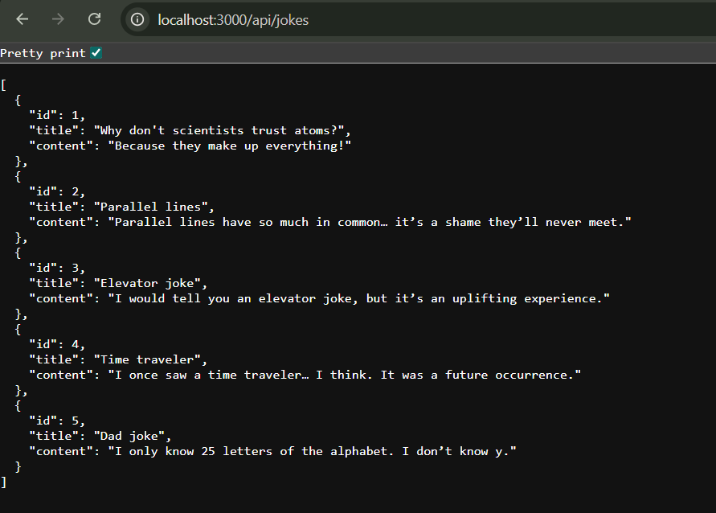

# connecting frontend with backend 

## solving CORS error using Frontend Proxy in ==> vite.config.js  file

```javascript
import { defineConfig } from 'vite'
import react from '@vitejs/plugin-react'

// https://vite.dev/config/
export default defineConfig({

  server: {
    proxy: {
      "/api" : "http://localhost:3000" 
      // now we have use proxying now for server request is comong from this url and not 5173(vite) so no cors error
    }
  },

  plugins: [react()],
})
```
## Screenshots

# this  is how data displayed at Frontend


# this  is how data displayed at Backend
